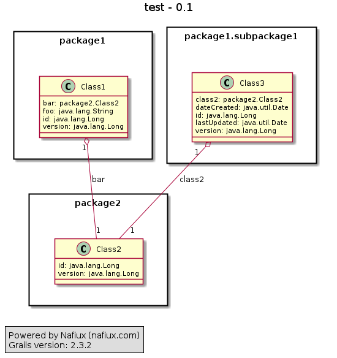

grails-plugin-class-domain-uml
=============================

Automagically create a UML diagram from all your domain classes of your Grails app.

Version 0.1.5 - Powered by [Nafiux](http://www.nafiux.com)

Waiting validation into http://grails.org/plugins/pending/227

## Features

* Classes whitin packages
* Fields data type and relations

## Installation

Add `runtime ":class-domain-uml:0.1.5"` to **BuildConfig.groovy** in plugins section (requires grails 2.0 > *).

## Usage

Run your app and navigate to `http://localhost:8080/yourApp/classDomainUML`

## Screenshots

This plugin has been possible thanks to [PlantUML project](http://plantuml.sourceforge.net/). Diagrams are rendered in [PlantUML server](http://www.plantuml.com/plantuml).
