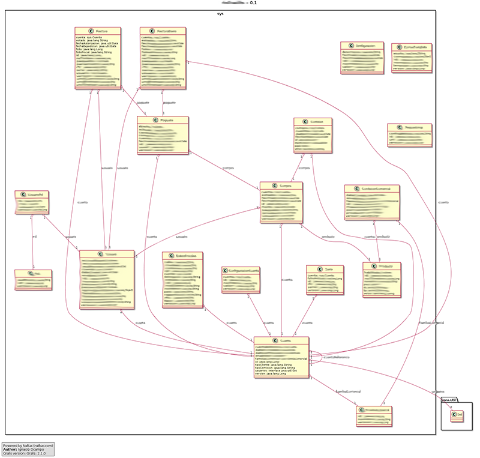

grails-plugin-class-domain-uml
=============================

Automagically create a UML diagram from all your domain classes of your Grails app.

## Installation

Add `runtime ":class-domain-uml:0.1.5"` to **BuildConfig.groovy** in plugins section.

## Usage

Run your app and navigate to `http://localhost:8080/yourApp/classDomainUML`

## Screenshots

### Example 1

